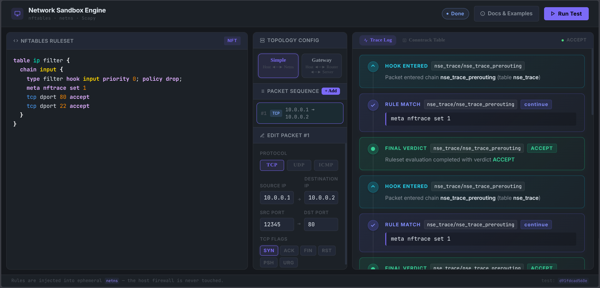
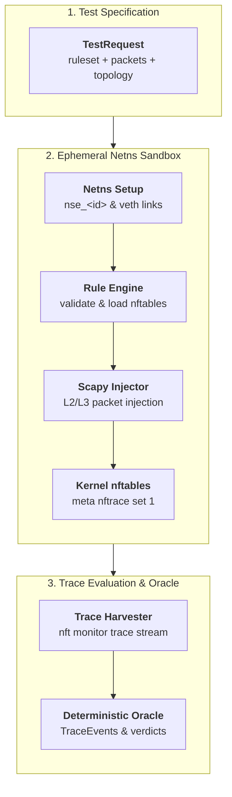

<!--
Copyright (c) 2026 onyks-os
SPDX-License-Identifier: MIT
-->

<h1 align="center">
  Network Sandbox Engine (NSE)
</h1>

<h4 align="center">A Linux engine for deterministic <b>nftables firewall testing</b> inside isolated network namespaces.</h4>

<p align="center">
  
  
  <a href="https://github.com/onyks-os/NetworkSandboxEngine/actions/workflows/ci.yml"></a>
  <a href="https://onyks-os.github.io/NetworkSandboxEngine/"></a>
  <a href="https://pypi.org/project/network-sandbox-engine/"></a>
  
</p>

<p align="center">
  <a href="#why-nse">Why NSE?</a> •
  <a href="#features">Features</a> •
  <a href="#requirements">Requirements</a> •
  <a href="#installation">Installation</a> •
  <a href="#quickstart">Quickstart</a> •
  <a href="#how-it-works">How It Works</a> •
  <a href="#project-structure">Project Structure</a>
</p>

---

<p align="center">
  
</p>

---

## Why NSE?

Testing firewall rulesets on a live Linux system poses significant risks: malformed rules can drop SSH management sessions, leak cleartext traffic during testing, or leave orphan firewall tables active on the host.

Network Sandbox Engine (NSE) provides a safe, reproducible testing harness. It constructs ephemeral Linux network namespaces, wires virtual ethernet pairs, compiles `nftables` rulesets, and injects synthetic Layer 2 and Layer 3 packets using Scapy. All evaluation happens inside the sandbox namespace: host firewall state is never altered.

Key architectural properties:

* **Zero Host Mutation**: Rulesets are loaded exclusively into ephemeral sandbox namespaces (`nse_<uuid>`) and are completely removed during teardown.
* **Self-verifying Oracle**: Every run injects a *canary* packet before the test packets and again after them, and reports a result only if the kernel trace for both was observed. See [The oracle contract](#the-oracle-contract).
* **Dual-Stack and Topologies**: Native support for IPv4 and IPv6 traffic, plus multi-namespace Gateway topologies for router, NAT, and forwarding ruleset validation.
* **Small, auditable surface**: One package, no web server, no JavaScript. `nse/` is ~1150 statements at 98% test coverage.

### Requires root

NSE creates network namespaces, loads nftables rulesets and reads kernel trace
events, so it runs as root. It does not open a socket, a port or an RPC endpoint
of any kind — it is a library and a CLI that you invoke, and it holds privileges
only for the duration of a run.

Version 2.1.0 removed the FastAPI/Svelte web interface that earlier releases
shipped. That interface ran in-process as root from 2.0.0 onward, which was a
large attack surface for a testing tool; the code remains in the git history at
tag `v2.0.0` if you need it.

---

## The oracle contract

A firewall test is a negative assertion — *"this packet did not get through"* —
and a negative assertion is worth nothing unless the instrument is known to be
working. A trace monitor that never attached to the kernel and a firewall that
blocked everything produce byte-identical output.

NSE therefore refuses to report a verdict it cannot show it measured:

| Guarantee | Mechanism |
| :--- | :--- |
| The monitor was attached **before** the first test packet | A readiness canary is injected and re-injected until its kernel trace is observed. No observation, no run. |
| The monitor was **still** attached after the last one | A liveness canary runs after injection. If it is missed, the verdict stream is declared truncated. |
| The parser understood what the kernel said | Trace lines that no pattern matches are counted, and any count above zero is an error rather than a debug log. |
| The monitor did not die quietly | The read loop records *why* it ended — clean stop, unexpected EOF, timeout or crash — and only a clean stop is acceptable. |
| A missing verdict is not a pass | The CLI runner fails when the number of observed verdicts differs from the number expected, in either direction. |

Canary packets are excluded from results by trace id, so they never appear in
your verdict stream.

The suite proves this holds, rather than asserting it: `make test-blind` forces
the parser to understand nothing, and the build fails unless the runner exits
non-zero. That job runs in CI on every push.

---

## Features

* **In-Process Engine**: Direct Python API (`run_test_pipeline`) returning structured Pydantic models (`TestRequest`, `TraceEvent`).
* **Scapy Packet Injection**: Forge arbitrary TCP (with custom SYN, ACK, FIN, RST flags), UDP, ICMP, and ICMPv6 packets.
* **Isolated Topologies**:
  * **Simple**: Single sandbox namespace (`nse_<id>`) wired directly to the host.
  * **Gateway**: Router (`nse_router_<id>`) and Server (`nse_server_<id>`) chain for forwarding and NAT testing.
* **Automated Cleanup**: Startup sweeps detect and remove leftover namespaces and veth pairs from previous aborted runs. Teardowns include exponential backoff retries.
* **CLI YAML Test Runner**: Execute declarative YAML test suites for automated CI/CD pipelines (`nse-runner`). Exits non-zero on a wrong verdict *and* on a verdict it failed to observe.
* **Strict Quality Standards**: Full static type checking (`mypy --strict`), architectural boundary enforcement (`import-linter`), `ruff` formatting, and a coverage ratchet (`make test-cov`, floor 98%).

---

## Requirements

* **Linux OS** (Kernel 5.4 or later with network namespace and nftables support)
* **Python 3.10+**
* **nftables** (`nft`)
* **iproute2** (`ip`)
* **Root privileges** (required for `ip netns` and kernel trace operations)

On Debian or Ubuntu systems:

```bash
sudo apt update && sudo apt install -y nftables iproute2 conntrack
```

---

## Installation

### 1. PyPI Package (Recommended)

Install the core engine with CLI support:

```bash
pip install "network-sandbox-engine[cli]"
```

### 2. Manual Source Install

For local development:

```bash
git clone https://github.com/onyks-os/NetworkSandboxEngine.git
cd NetworkSandboxEngine
make setup
```

---

## Quickstart

### 1. Headless Python Library

```python
import asyncio
from nse.core.netns_controller import NetnsController
from nse.core.pipeline import run_test_pipeline
from nse.models.test_request import TestRequest, PacketSpec

rules = """
table ip filter {
    chain input {
        type filter hook input priority 0; policy drop;
        tcp dport 80 accept
    }
}
"""

request = TestRequest(
    rules=rules,
    packets=[
        PacketSpec(protocol="tcp", src_ip="10.0.0.1", dst_ip="10.0.0.2", dst_port=80),
        PacketSpec(protocol="tcp", src_ip="10.0.0.1", dst_ip="10.0.0.2", dst_port=22),
    ],
)


async def main():
    controller = NetnsController()
    events = await run_test_pipeline(request=request, controller=controller)
    for evt in events:
        if evt.verdict:
            print(f"[{evt.chain}] Verdict: {evt.verdict}")


asyncio.run(main())
```

### 2. YAML Test Suite Runner (CLI)

Create a test file `firewall_test.yaml`:

```yaml
tests:
  - name: "Allow HTTP Port 80, Drop SSH Port 22"
    topology: simple
    rules: |
      table ip filter {
        chain input {
          type filter hook input priority 0; policy drop;
          tcp dport 80 accept
        }
      }
    packets:
      - protocol: tcp
        src_ip: 10.0.0.1
        dst_ip: 10.0.0.2
        dst_port: 80
        expected_verdict: ACCEPT
      - protocol: tcp
        src_ip: 10.0.0.1
        dst_ip: 10.0.0.2
        dst_port: 22
        expected_verdict: DROP
```

`expected_verdict` is per packet. Unknown keys are rejected rather than
defaulted, so a typo fails the suite instead of quietly becoming an expectation
you never wrote.

Run the suite with root privileges:

```bash
sudo nse-runner --file firewall_test.yaml
```

Exit codes: `0` all packets matched; `1` a verdict was wrong **or** the engine
could not observe one. Oracle errors are reported separately from firewall
failures, because they mean the measurement broke, not the ruleset.

### 3. In a container

```bash
podman build -t nse .
podman run --rm --cap-add=NET_ADMIN --cap-add=NET_RAW \
    -v "$PWD/firewall_test.yaml:/suite.yaml:ro" nse --file /suite.yaml
```

Useful for pinning the nftables version your rules are tested against.

---

## How It Works

NSE orchestrates Linux kernel network subsystems and trace interfaces through a structured multi-stage execution pipeline:



1. **Ruleset Validation**: `RuleEngine.validate()` dry-runs the ruleset using `nft --check -f`.
2. **Sandbox Provisioning**: `NetnsController` creates the isolated network namespace and configures virtual ethernet (`veth`) interfaces.
3. **Trace Initialization**: Rulesets are loaded into the namespace with kernel tracing armed (`meta nftrace set 1`).
4. **Packet Injection**: `ScapyInjector` injects synthetic frames across the veth link.
5. **Verdict Harvesting**: `TraceHarvester` captures `nft monitor trace` events and returns structured `TraceEvent` objects.
6. **Teardown**: The namespace and all associated veth interfaces are automatically deleted.

For complete technical specifications, see the [Technical Architecture Guide](docs/ARCHITECTURE.md).

---

## Project Structure

```text
NetworkSandboxEngine/
├── nse/                        # Core PyPI package (network-sandbox-engine)
│   ├── core/                   # Kernel primitives, pipeline, and naming rules
│   ├── models/                 # Pydantic models (TestRequest, PacketSpec, TraceEvent)
│   └── cli/                    # Headless YAML runner entrypoint
├── docs/                       # Architecture specs and MkDocs web documentation
├── tests/                      # Unit, golden file, and privileged e2e tests
│   └── fixtures/nft_trace/     # Golden `nft monitor trace` corpus
├── pyproject.toml              # Build backend configuration
└── Makefile                    # Local automation and CI workflow
```

---

## Documentation

Full interactive web documentation is available at:  
[https://onyks-os.github.io/NetworkSandboxEngine/](https://onyks-os.github.io/NetworkSandboxEngine/)

Build the documentation locally:

```bash
make docs
```

Serve the documentation with hot-reload on `http://127.0.0.1:8000`:

```bash
make docs-serve
```

---

## Testing & Local CI

Run static linting and unit tests:

```bash
make verify
```

Run full local CI verification (includes linting, unit tests, frontend build, docs build, PyPI smoke test, and privileged integration tests):

```bash
make ci-local
```

---

## License

This project is licensed under the [MIT License](LICENSE).
