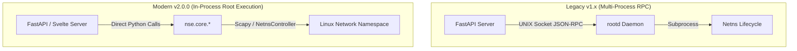

# Explanation: Architecture & In-Process Model

NSE v2.0.0 uses a single-process root architecture designed for maximum performance, minimal dependency overhead, and thread safety.

---

## Architectural Evolution: v1.x vs v2.0.0

### Why In-Process?

1. **Elimination of IPC Overhead**: Eliminates JSON serialization, socket connections, and daemon protocol management.
2. **Simplified Lifecycle**: A single root process owns the FastAPI web app and netns creation.
3. **Pydantic Model Consistency**: Direct passing of typed Pydantic models (`TestRequest`, `TraceEvent`) without schema duplication across boundaries.
