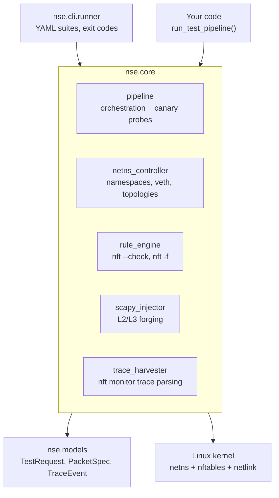

# Explanation: Architecture

NSE is a library and a CLI. There is no server, no socket, and no daemon: you
call it, it builds a namespace, measures, and tears the namespace down.

---

## Layers

`import-linter` enforces two boundaries in `make lint`:

* `nse.core` and `nse.models` must not import `nse.cli` — the engine cannot
  depend on the CLI that drives it;
* `nse.models` must not import the engine — models stay a leaf.

---

## Privilege model

NSE runs as root, because creating network namespaces, loading nftables rulesets
and reading kernel trace events all require it.

It holds those privileges only for the duration of a run, and it exposes no
network or IPC surface while it does. That is a deliberate change:

| Version | Model |
| :--- | :--- |
| 1.1.0 – 1.1.1 | An unprivileged FastAPI server delegating to an `nse-rootd` daemon over a UNIX socket. |
| 2.0.0 | The FastAPI server ran **in-process as root**. Fewer moving parts, considerably more attack surface. |
| 2.1.0 onward | No server at all. The web interface is archived; NSE is a library and a CLI. |

Removing the web layer removed the reason to have a long-lived root process, and
with it the JavaScript toolchain, the ASGI stack, and a CI job. For a tool whose
job is to be trusted about firewall behaviour, a smaller audited surface is worth
more than a GUI.

The code for the web interface remains in git history at tag `v2.0.0`.

---

## Isolation guarantee

Rulesets are only ever loaded inside `nse_<id>` / `nsr_<id>` / `nss_<id>`
namespaces. `RuleEngine.load()` refuses an empty namespace name outright, so a
missing argument cannot fall through to the host firewall. Teardown removes both
the namespaces and the host-side veth interfaces, with a retry backoff, and a
startup sweep removes anything a previous crashed run left behind.
