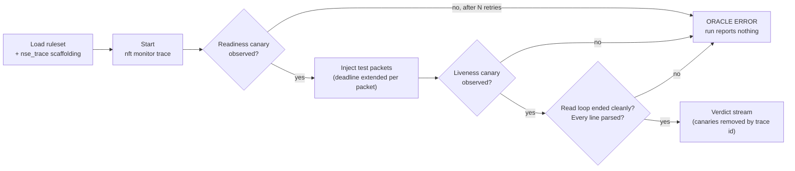

# Explanation: The Verdict Oracle

NSE decides pass/drop outcomes from kernel `nftables` trace events. This page is
about the part that matters more than the parsing: **how NSE knows it was
looking**.

---

## The problem this solves

A firewall test is a negative assertion — *"this packet did not get through"*.
Negative assertions have a failure mode that positive ones do not: if the
instrument stops working, the assertion still holds. A trace monitor that never
attached to the kernel produces exactly the same output as a firewall that
blocked everything.

Up to 2.0.0, NSE had that failure mode in three places at once:

* the readiness probe signalled when the *read loop* was scheduled, not when
  `nft monitor trace` had subscribed to the kernel;
* the trace deadline was fixed when the loop started, so a long packet sequence
  outlived it and the verdict stream was truncated with no error;
* the CLI runner treated a mismatch between expected and observed verdict counts
  as something to print, not something to fail on.

Together, a completely blind run exited 0.

---

## The contract

Every run carries its own positive control.

1. **Trace scaffolding**: `RuleEngine.load()` prepends a `table inet nse_trace`
   prerouting chain with `meta nftrace set 1`, so every packet entering the
   namespace produces trace events.
2. **Readiness canary**: a probe packet is injected and re-injected until *its
   own* kernel trace event is observed. This is a proof, not a signal: nothing
   proceeds until the kernel has demonstrably delivered an event.
3. **Sequential injection**: test packets go in one at a time, and the trace
   deadline is pushed forward after each one. The read loop polls its deadline,
   so an extension takes effect even while it is parked on a read.
4. **Liveness canary**: a second probe after the last test packet. If it is not
   observed, the monitor stopped watching part-way through and the verdict stream
   is truncated by an unknown amount.
5. **Health check**: the harvester's terminal state must be a clean stop — not an
   unexpected EOF, a timeout or a crash — and its count of unparsed trace lines
   must be zero.
6. **Reporting**: canary trace ids are removed from the results, so probes never
   appear in your verdict stream.

Any failure in steps 2, 4 or 5 emits an `error` event. The CLI runner fails on
error events, and reports them as **oracle errors**, kept separate from firewall
failures in the summary: a broken measurement and a broken ruleset are different
problems and want different fixes.

---

## Verdict reduction

`reduce_verdicts()` collapses a trace stream into one verdict per packet:

* events are grouped by `trace_id` — one packet's traversal of the netfilter
  stack shares an id across chains;
* events from the `nse_trace` scaffolding table are excluded, since they exist
  only to switch tracing on;
* `DROP` and `REJECT` beat `ACCEPT`, because a packet accepted by one chain and
  dropped by another did not get through;
* a trace id that reached the user ruleset but produced **no** verdict is
  omitted. That makes the observed count differ from the expected count, which
  is an oracle error — deliberately, rather than being rounded up to a pass.

`REJECT` is indistinguishable from `DROP` in the reduced stream, so an
expectation of `REJECT` is compared as `DROP`.

---

## Proving the contract holds

The guarantee above is itself tested. Setting `NSE_FORCE_BLIND=1` makes the
parser understand nothing — which is what a kernel trace format change looks like
from the outside — and `make test-blind` asserts that the suite then **fails**.
That job runs in CI on every push.

Separately, `test_parser_understands_every_line_of_a_real_trace` asserts, against
whatever kernel the runner has, that a real run left zero trace lines unparsed.
CI runs it on more than one image so a format change breaks a build rather than
silently blinding the oracle.
