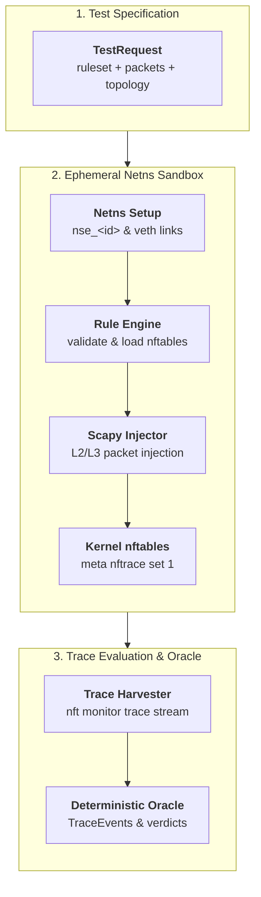

# Network Sandbox Engine (NSE) v2.0.0

**Deterministic Linux network namespace isolation and kernel `nftables` trace evaluation engine.**

---

## What is NSE?

Network Sandbox Engine (NSE) is a Python library and CLI tool designed for testing, verifying, and debugging Linux `nftables` firewall rulesets inside ephemeral, zero-leak network namespaces (`netns`).

NSE allows security engineers, TTP developers, and CI/CD pipelines to validate complex network filtering rulesets **without mutating host firewall state or requiring dedicated VMs**.



---

## Key Features

- **In-Process Architecture**: Single-process root execution eliminating separate daemons (`rootd`) or IPC sockets.
- **Deterministic Verdict Oracle**: Per-packet injection and kernel trace harvesting with instant readiness probes (`wait_ready()`).
- **Isolated Topologies**: Supports **Simple** (single sandbox netns) and **Gateway** (router + server netns chain) topologies.
- **Scapy Packet Injection**: Forge arbitrary TCP, UDP, and ICMP packets across IPv4 and IPv6 protocols.
- **Robust Netns Lifecycle**: Automated startup sweeps of orphan namespaces and veth pairs with exponential backoff teardowns.
- **Full Type Safety & Strict Lints**: Built with Pydantic v2, `mypy --strict`, `import-linter`, and `ruff`.

---

## Quick Example

```python
import asyncio
from nse.core.netns_controller import NetnsController
from nse.core.pipeline import run_test_pipeline
from nse.models.test_request import TestRequest, PacketSpec

rules = """
table ip filter {
    chain input {
        type filter hook input priority 0; policy drop;
        tcp dport 80 accept
    }
}
"""

request = TestRequest(
    rules=rules,
    packets=[
        PacketSpec(protocol="tcp", src_ip="10.0.0.1", dst_ip="10.0.0.2", dst_port=80),
        PacketSpec(protocol="tcp", src_ip="10.0.0.1", dst_ip="10.0.0.2", dst_port=22),
    ],
)

async def main():
    controller = NetnsController()
    events = await run_test_pipeline(request=request, controller=controller)
    for evt in events:
        if evt.verdict:
            print(f"Packet verdict: {evt.verdict}")

asyncio.run(main())
```

---

## Navigation & Sections

- **[Quickstart Guide](tutorials/quickstart.md)**: Get up and running in 5 minutes.
- **[Test Suite YAML](tutorials/test-suites.md)**: Define declarative YAML test suites for CLI execution.
- **[In-Process Integration](how-to/in-process-integration.md)**: Integrate NSE into FastAPI, Svelte, or Python applications.
- **[Architecture & Flow](explanation/architecture.md)**: In-depth breakdown of in-process netns execution.
- **[Python API Reference](reference/api.md)**: Complete auto-generated Python API documentation.
