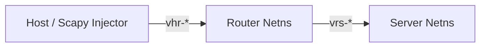

# Gateway Topology Testing

In addition to simple single-namespace testing, NSE supports **Gateway Topologies** for testing router, NAT, and forwarding firewall rulesets.

---

## Topology Architecture

A Gateway topology spawns two interconnected network namespaces:

1. **Router Netns (`nse_router_<id>`)**: Receives packets on `veth_router_host` and forwards them to `veth_router_server`.
2. **Server Netns (`nse_server_<id>`)**: Houses background mock listeners and target endpoints.



---

## YAML Gateway Example

```yaml
tests:
  - name: "Router Forwarding Allow Port 53 UDP"
    topology: gateway
    rules: |
      table ip filter {
        chain forward {
          type filter hook forward priority 0; policy drop;
          udp dport 53 accept
        }
      }
    mock_listeners:
      - protocol: udp
        port: 53
    packets:
      - protocol: udp
        src_ip: 10.0.1.1
        dst_ip: 10.0.2.2
        dst_port: 53
      - protocol: udp
        src_ip: 10.0.1.1
        dst_ip: 10.0.2.2
        dst_port: 54
    expected_verdicts:
      - ACCEPT
      - DROP
```

---

## Programmatic Gateway Usage

```python
from nse.models.test_request import TestRequest, TopologyType, PacketSpec
from nse.core.pipeline import run_test_pipeline

request = TestRequest(
    topology=TopologyType.GATEWAY,
    rules="""
    table ip filter {
        chain forward {
            type filter hook forward priority 0; policy drop;
            ip daddr 10.0.2.2 udp dport 53 accept
        }
    }
    """,
    packets=[
        PacketSpec(protocol="udp", src_ip="10.0.1.1", dst_ip="10.0.2.2", dst_port=53)
    ]
)

events = await run_test_pipeline(request=request)
```
